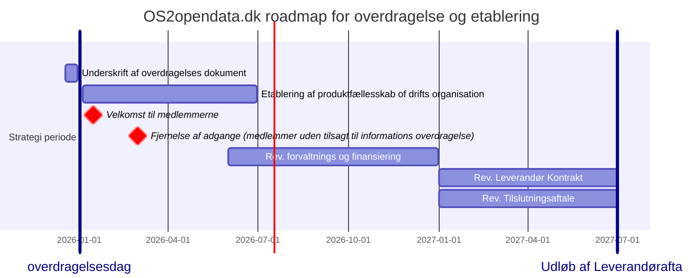

---
# OS2opendata.dk

Der ydes assistance til formalisering af overdragelsesbetingelserne. 

Roadmap og timeline for overdragelsen er som flg:

```mermaid
gantt
    dateFormat  YYYY-MM-DD
    title       OS2opendata.dk roadmap for overdragelse og etablering
  
    %% (`excludes` accepts specific dates in YYYY-MM-DD format, days of the week ("sunday") or "weekends", but not the word "weekdays".)
    
   section Strategi periode
   overdragelsesdag                                : vert, v1, 2026-01-01,
   Underskrift af overdragelses dokument          :des1, 2025-12-18, 2025-12-30
   Etablering af produktfællesskab of drifts organisation              :des2, 2026-01-05, 2026-06-30
   Velkomst til medlemmerne             :crit, milestone, m1,2026-01-15, 0d
   Fjernelse af adgange (medlemmer uden tilsagt til informations overdragelse) :crit, milestone, m1,2026-03-01, 0d
   Rev. forvaltnings og finansiering               :des2, 2026-06-01, 2026-12-31
   Rev. Leverandør Kontrakt                         :des3, 2027-01-01, 2027-07-01
   Rev. Tilslutningsaftale                          :des4, 2027-01-01, 2027-07-01
   Udløb af Leverandøraftale                             : vert, v2, 2027-06-30,
``` 
