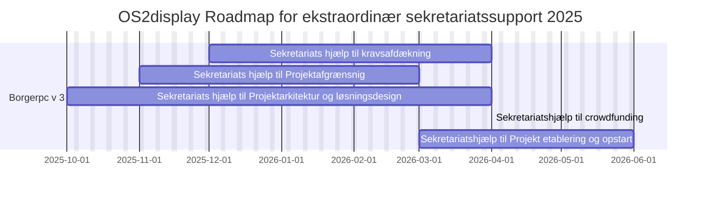

📆 _sidst opdateret: {{ site.time | date: '%B %d, %Y' }}_

# OS2borgerpc: Sekretariatssupport til produkmodernisering

```mermaid
gantt
    dateFormat  YYYY-MM-DD
    title       OS2display Roadmap for ekstraordinær sekretariatssupport 2025
    excludes    weekends
    tickInterval 1quarter
    %% (`excludes` accepts specific dates in YYYY-MM-DD format, days of the week ("sunday") or "weekends", but not the word "weekdays".)
    section  Borgerpc v 3
    Sekretariats hjælp til kravsafdækning                          :2025-12-01, 2026-04-01
    Sekretariats hjælp til Projektafgrænsnig                       :2025-11-01, 2026-03-01
    Sekretariats hjælp til Projektarkitektur og løsningsdesign     :2025-10-01, 2026-04-01
    Sekretariatshjælp til crowdfunding                             :2026-12-01, 2026-04-01
    Sekretariatshjælp til Projekt etablering og opstart            :2026-03-01, 2026-06-01
```
