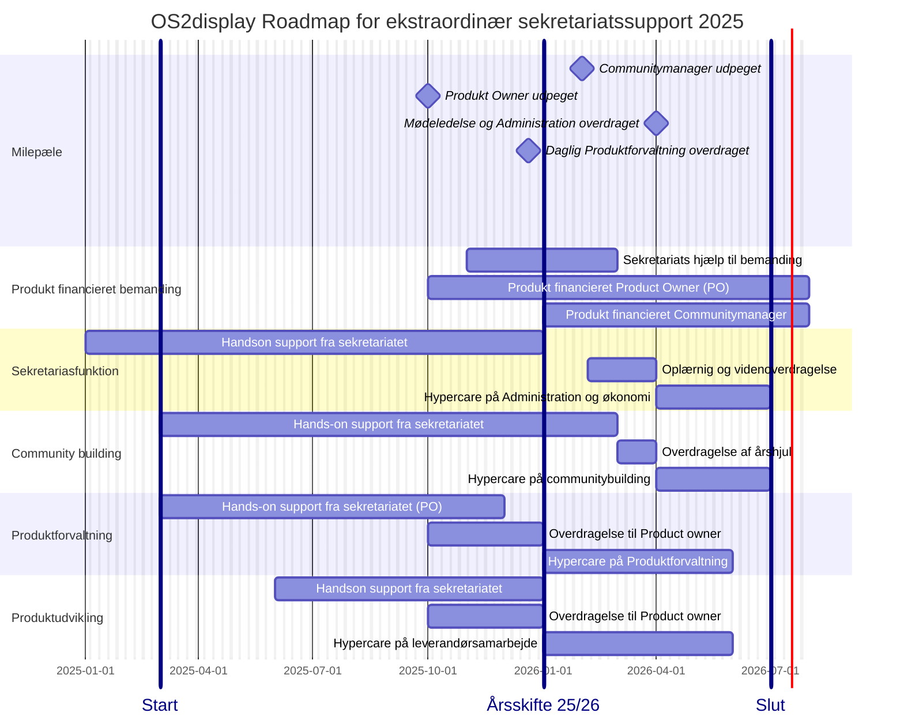

📆 _sidst opdateret: {{ site.time | date: '%B %d, %Y' }}_

# OS2borgerpc: Roadmap og Timeline for ekstraordinær sekretariats-support

______________

Den ekstraordinære Sekretariatssupporten til OS2borgerpc har til formål at styrke produktsamarbejdet og fremme produktudbredelsen, og har været financieret af OS2 samarbejdet siden 2023.

Den ekstra ordinære indsats vil blive udfaset i løbet af 2025, hvorefter sekretariatsstøtten til den eksisterende version af produktet vil fortsætte på lige vilkår med andre OS2produkter.

Den ekstraordinære Sekretariatssupporten i 2025/26  kan deles i  op flg hovedspor, 

1. Sekretariasfunktion og økonomirapportering
2. Community building og communitybuilding
3. Produktforvaltning og vedligehold
4. Produktudvikling og leverandørsamarbejde

De to første spor handler om administration, kommunikation og communitybuilding, og kan håndteres af en Produktkoordinator eller en Communitymanager med generel AC kompetence
De to sidste handler om produktudvikling, leveralceledelse og leverandørsmarbejde, og kan håndtere af en Product owner som har praktisk erfaring med IT udvikling og vedligehold. 
______________

I forbindelse med udfasningen af den ekstratordinære sekretariatssupport er der brug ofr at OS2 fællesskaber afsætter midler til frikøb af 2 deltidsressorucer:

 1. en Produkt Adminiatrator eller Koordinator med ansvar for Administration, Kommunikation og Koordination 
 2.  en Product Owner med ansvar for produktforvaltning og produkt udvikling

OS2 forms vil fortsat modtage support fra sekretariatet, i form af rådgivning, vejledning og praktisk AD-hoc bistand.  

De to identificerede ressorucer vil derudover blive en del af OS2s "korps" af Produkt koordinatorer, communituymanagere og Product Owners, med alt hvad det medførere af vidensdeling, skabelonudveksling og kompetenceopbygning. 
______________

De fire hovedspor i den tildelte sekteratiats support har indtil 2025 flg kerneaktivitete
   
1. **Sekretariasfunktion** og økonomirapportering
- Administration og økonomiopfølgning
- Mødeplanlægning og referat skrivning
- administrativ onboarding af nye medlemmer
- opdatering af hjemmeside
- Publisering af referater

2. **Community building** og crowdfunding
- udarbejdelse af nyhedsbreve
- etablering af styregruppe
- Etablering af årshjul og mødepraksis for Styregruppe og Koordinationsgruppe
- Etablering af årshjul og praksis for Communitymøder
- Etablering afårshjul og praksis for Brugerklub møder ( anvendere)
- Etablering af årshjul og praksis for teknisk erfagruppemøder (kommunale driftsafdelinger og drifts leverandører)
        
3. **Produktforvaltning** og leverandørsamarbejde
- Etablering af forvaltningsorganisation 
- revision af contribution guidelines 
- Etablering af beslutningslog
- Etablering af vedligeholdelses praksis

4. **Produktudvikling** og vedligehold af Kildekode
- udarbejdelse af produktbeskrivelse og udbedring af dokumentation
- Releasemanagement & Bugfix håndtering ( optimering & opstramning incl 12 måbneders roadmap)
- Etablering af transperat issuetrackingen i github
- Udarbejdelse af 12 mdr roadmap for Vedligehold og sikkerhedsopdateringer
