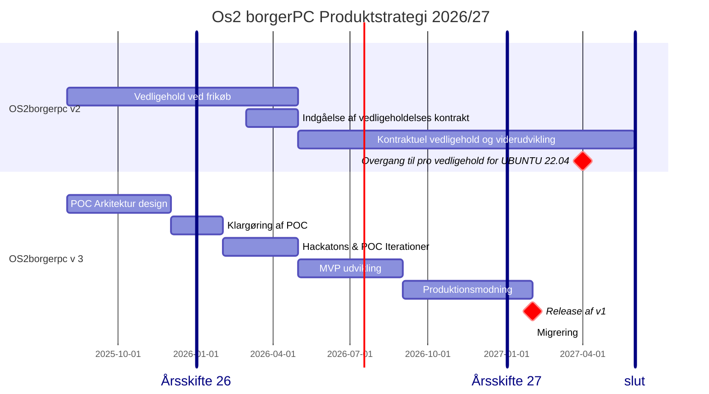

📆 _sidst opdateret: {{ site.time | date: '%B %d, %Y' }}_

# OS2borgerpc Produktstrategi 2026-2027  

OS2borgerpc står overfor en gennemgribende opgradering, revision og modernisering, som blandt andet inkludere en omkostningstung opgradering af det underliggende styresystem ( Ubuntu 22.04) og dertilhørende omskrivninge i kodebasen. 

De indledende analyser har vist at det bliver omkostningstungt at gennemføre en sådan opgradering og ressourcekrævende at vedligeholde løsningen efterfølgende. 
Derfor har produktets styre- og koordinationsgruppe besluttet at det er tid til se sig om efter alternative moderne løsninger.

Produktstrategien for 2026/2027 er derfor at man holder den eksisterende løsning sikker og stabil og dens kodebase opdateret, imedens man i paralell afprøver og produktionsmodner en moderne og digitalsuverænt erstatning.

Den overordnede strategi for 2026 og 2027 er som flg:
1. **OS2borgerPC v2 forvaltningen fortsætter i sin nuværende form**, med fokus på sikkerheds opdatering og driftsstabilitet, samt minimal indsats i forhold til featureudvilling.
2. **OS2borgerpc V3 designes og produktmodnes i et paralell projekt**,  med fokus på afprøvning og evaluering af eksisterende Open-Source løsninger og konfigurering af en moderne og digital suveræn biblioteksPC. 

# OS2borgerpc: Produktstrategi 2026/2027 produkt roadmap

