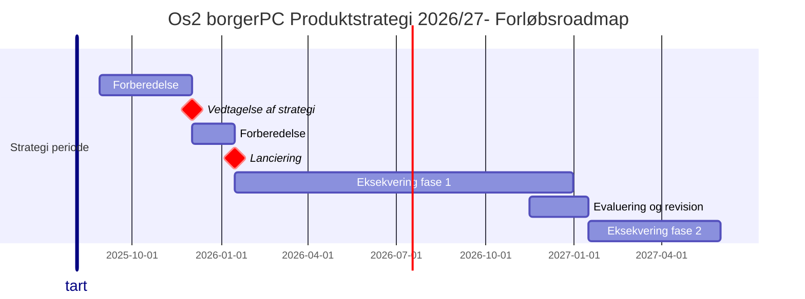
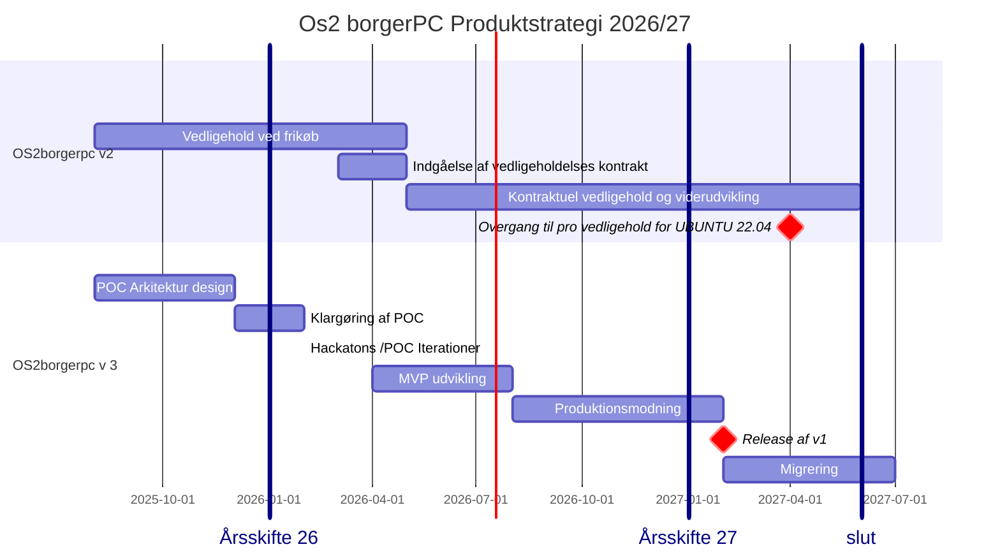

📆 _sidst opdateret: {{ site.time | date: '%B %d, %Y' }}_

# OS2borgerpc: Produktstrategi 2026/2027  

```mermaid
gantt
    dateFormat  YYYY-MM-DD
    title       Os2 borgerPC Produktstrategi 2026/27- Forløbsroadmap
  
    %% (`excludes` accepts specific dates in YYYY-MM-DD format, days of the week ("sunday") or "weekends", but not the word "weekdays".)
    
   section Strategi periode
   tart                                : vert, v1, 2025-08-04,
   Forberedelse                        :des1, 2025-08-028, 2025-12-02
   Vedtagelse af strategi          :crit, milestone, m1,2025-12-02, 0d
   Forberedelse                          :des2, 2025-12-02, 2026-01-15
   Lanciering                    :crit, milestone, m1,2026-01-15, 0d
   Eksekvering fase 1                  :des3, 2026-01-15, 2026-12-31
   Evaluering  og revision              :des3, 2026-11-15, 2027-01-15
   Eksekvering fase 2                  :des3, 2027-01-15, 2027-06-01

   
``` 

# OS2borgerpc: Produktstrategi 2026/2027 produkt roadmap

```mermaid
gantt
    dateFormat  YYYY-MM-DD
    title       Os2 borgerPC Produktstrategi 2026/27
  
    %% (`excludes` accepts specific dates in YYYY-MM-DD format, days of the week ("sunday") or "weekends", but not the word "weekdays".)
 
   section OS2borgerpc v2
   slut                                            : vert, v4, 2027-06-01,
   Årsskifte 26                                    : vert, v2, 2026-01-01,
   Vedligehold ved frikøb                     :des4, 2025-08-02, 2026-05-01
   Indgåelse af vedligeholdelses kontrakt     :des4, 2026-03-02, 2026-05-01
   Kontraktuel vedligehold og viderudvikling  :des5, 2026-05-01, 2027-06-01
   Overgang til pro vedligehold for UBUNTU 22.04 :crit, milestone, m1,2027-04-01, 0d
   
   section  OS2borgerpc v 3
   Årsskifte 27                                    : vert, v3, 2027-01-01,
   POC Arkitektur design                    :des1, 2025-08-02, 2025-12-02
   Klargøring af POC                       :des1, 2025-12-02, 2026-02-01
   Hackatons /POC Iterationer                        :des1, 2026-02-01, 2026-05    -01
   MVP udvikling                         :des1, 2026-04-01, 2026-08-01
   Produktionsmodning                      :des1, 2026-08-01, 2027-02-01
   Release af v1                          :crit, milestone, m1,2027-02-01, 0d
   Migrering                            :des5, 2027-02-01, 2027-07-01


``` 
