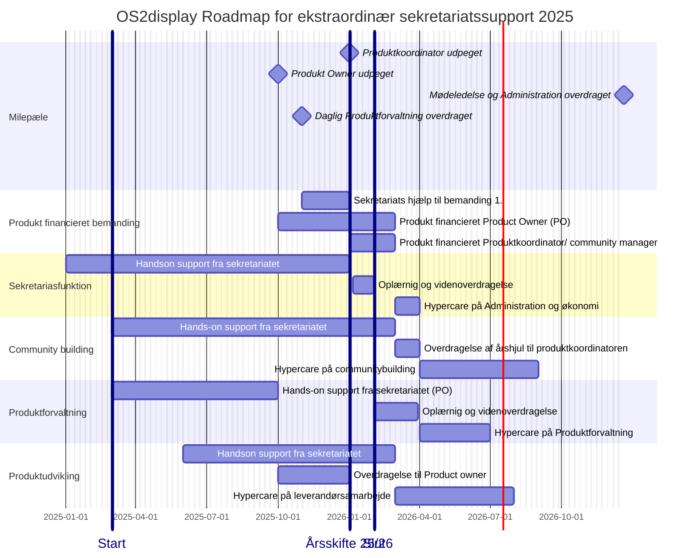

📆 _sidst opdateret: {{ site.time | date: '%B %d, %Y' }}_

# OS2borgerpc: Roadmap og Timeline for ekstraordinær sekretariats-support

```mermaid
gantt
    dateFormat  YYYY-MM-DD
    title       OS2display Roadmap for ekstraordinær sekretariatssupport 2025
    excludes    weekends
    tickInterval 1quarter
    %% (`excludes` accepts specific dates in YYYY-MM-DD format, days of the week ("sunday") or "weekends", but not the word "weekdays".)

    section  Milepæle
    Produktkoordinator udpeget   :milestone, a1,2026-01-01, 0d
    Produkt Owner udpeget        :milestone, a2,2025-10-01, 0d
    Mødeledelse og Administration overdraget          :milestone, a3,2026-12-20, 0d
    Daglig Produktforvaltning overdraget              :milestone, a4,2025-11-01, 0d
    Start                        : vert, v1, 2025-03-01,
    Årsskifte 25/26              : vert, v2, 2026-01-01,
    Slut                         : vert, v3, 2026-02-01,
   
    section  Produkt financieret bemanding
    Sekretariats hjælp til bemanding 1.                                 :2025-11-01, 2026-01-01
    Produkt financieret Product Owner (PO)                              :2025-10-01, 2026-03-01
    Produkt financieret Produktkoordinator/ community manager           :2026-01-01, 2026-03-01

    section  Sekretariasfunktion
    Handson support fra sekretariatet              :2025-01-01, 2026-01-01
    Oplærnig og videnoverdragelse                  :2026-01-05, 2026-02-01
    Hypercare på Administration og økonomi         :2026-03-01, 2026-04-01

    section  Community building
    Hands-on support fra sekretariatet               :2025-03-01, 2026-03-01
    Overdragelse af årshjul til produktkoordinatoren :2026-03-01, 2026-04-01
    Hypercare på communitybuilding                   :2026-04-01, 2026-09-01

    section  Produktforvaltning
    Hands-on support fra sekretariatet (PO)        :2025-03-01, 2025-10-01
    Oplærnig og videnoverdragelse                  :2026-02-01, 2026-03-30
    Hypercare på Produktforvaltning                :2026-04-01, 2026-07-01

    section  Produktudvikling
    Handson support fra sekretariatet                           :2025-06-01, 2026-03-01
    Overdragelse til Product owner                              :2025-10-01, 2026-01-01
    Hypercare på leverandørsamarbejde                           :2026-03-01, 2026-08-01

```
