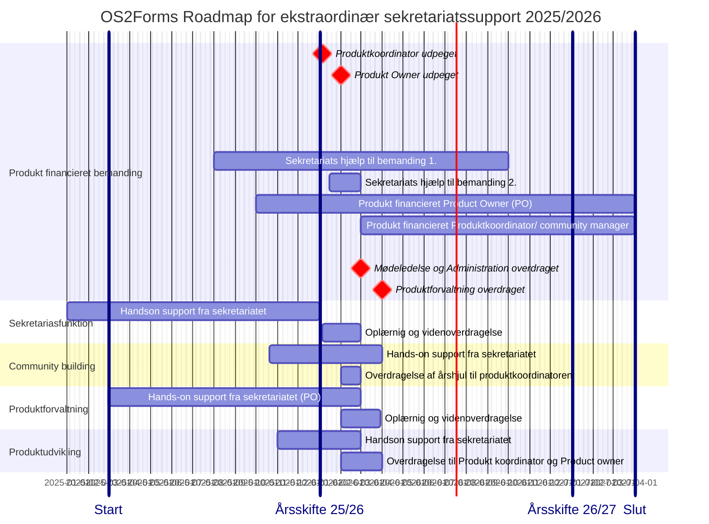

📆 _sidst opdateret: {{ site.time | date: '%B %d, %Y' }}_

# OS2display: Roadmap og Timeline for ekstraordinær sekretariats-support

______________

Den ekstraordinære Sekretariatssupporten til OS2display har til formål at styrke produktsamarbejdet og fremme produktudbredelsen, og har været financieret af OS2 samarbejdet siden 2023.
Den ekstra ordinære indsats vil blive udfaset i løbet af 2027, hvorefter sekretariatsstøtten til OS2display vil fortsætte på lige vilkår med andre OS2produkter.

Den ekstraordinære Sekretariatssupporten der ydes til OS2display 2025-2027 kan deles op flg hovedspor, 

1. Forandringsledelse og formalisering i forbindelse med Overtagelse af Kildekode 
2. Sekretariasfunktion og økonomirapportering
3. Community building og communitybuilding
4. Produktforvaltning og vedligehold
5. Produktudvikling og leverandørsamarbejde

De to første spor handler om administration, kommunikation og communitybuilding, og kan håndteres af en Produktkoordinator eller en Communitymanager med generel AC kompetence
De to sidste handler om produktudvikling, leveralceledelse og leverandørsmarbejde, og kan håndtere af en Product owner som har praktisk erfaring med IT udvikling og vedligehold. 
______________

I forbindelse med udfasningen af den ekstratordinære sekretariatssupport er der brug ofr at OS2 fællesskaber afsætter midler til frikøb af 2 deltidsressorucer:
   1. en Produkt koordinator eller community manager ansvar for Administration, Kommunikation og Koordination 
   2. en Product Owner med ansvar for produktforvaltning og produkt udvikling

OS2 forms vil fortsat modtage support fra sekretariatet, i form af rådgivning, vejledning og praktisk AD-hoc bistand.  
De to identificerede ressorucer vil derudover blive en del af OS2s "korps" af Produkt koordinatorer, communituymanagere og Product Owners, med alt hvad det medførere af vidensdeling, skabelonudveksling og kompetenceopbygning. 
______________

De fire hovedspor i den tildelte sekteratiats support har dækker over flg kerneaktiviteter

1. **Forandringsledelse** og formalisering i forbindelse med Overtagelse af Kildekode

   
3. **Sekretariasfunktion** og økonomirapportering

4. **Community building** og crowdfunding

        
5. **Produktforvaltning** og leverandørsamarbejde

      
6.  **Produktudvikling** og vedligehold af Kildekode
