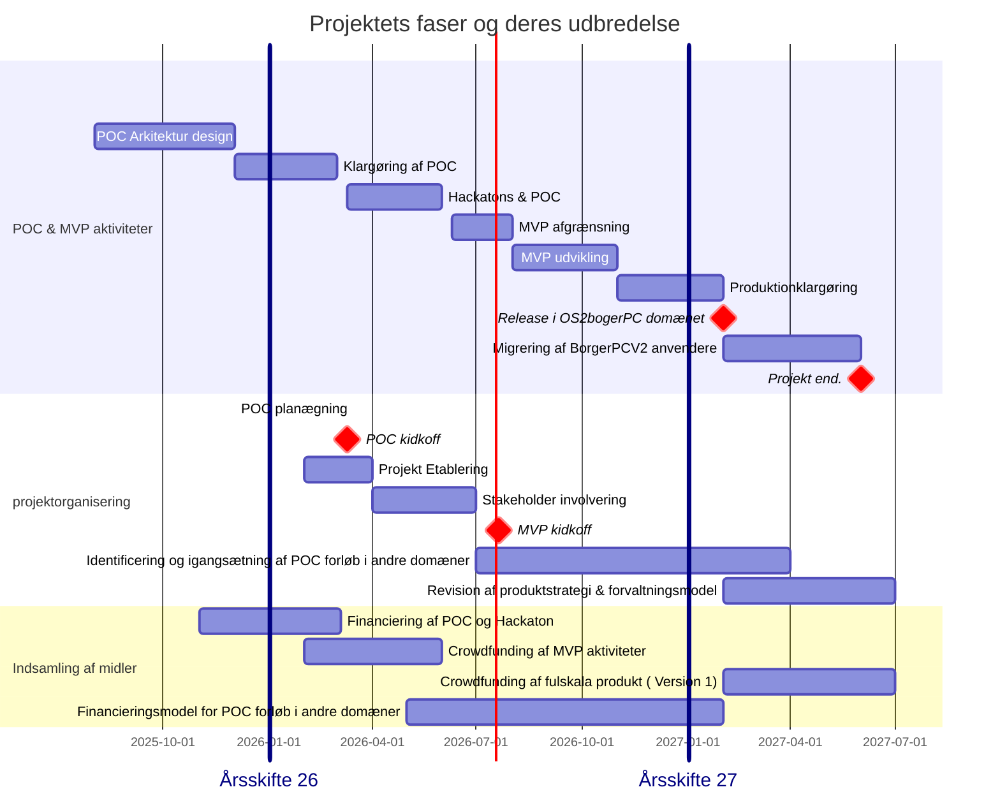

📆 _sidst opdateret: {{ site.time | date: '%B %d, %Y' }}_

# NornNet —  frembringelse af digital suveræne brugerdevices. 

Navnet NornNet stammer fra den nordiske mytologi og henviser til det net af lives og skæbnetråde som Nornerne væver og vedligeholder.

I en teknbologisk anvendelsesorienteret kontekst er NornNet, som produkt den infrastruktur der:
- versionsstyrer og dokumenterer hver konfiguration og image (skæbnetråd)
- sikrer sporbarhed, audit og governance på tværs af domæner
- understøtter deklarativ konfiguration og reproducerbar udrulning
- håndterer livscyklus (deploy, rollback, attest) på en kontrolleret måde.
- faciliterer frembringelse af deklarativt konfigurerede, versionsstyrede og digital suveræne brugerdevices. 

Vi anvender NornNet som arbejdsbetegnelsen for projekt og projekt leverance  idet:

- Projektdeltagerne kan ses som de Norner der spriner trådene 
- Projektet er den process der ligger bag etablering af nettet 
- Produktet er det uendelige net af digitale tråde der sikrer enhedernes sikkerhed, stabilitet funktionalitet og anvendelighed,

## Projekt introduktion

**Projektnavn**: Nornet

**Tagline**:  NornNet —  frembringelse af digital suveræne brugerdevices

**Projekt ejer**: Thor Dekov Buur, styregruppe formand i OS2borgerpc og medlem af OS2's bestyrelse. (den person/organisation med formelt ansvar og budget‑/strategisk mandat; kontaktinfo.)

**Projekt Lead:**  Anna-Lis Berg OS2produktkonsulent og community builder

**Lead Architect** Jan Maack Kjerbye OS2 Enterprise Atkitekt

**Produkt tilknytning**: 
- Projektet udspringer fra OS2borgerPC og financieres indledningsvist af produktmidler hentet derfra. 
- Projektet har en stram strategisk deadline og fokuserer derfor på etablering af fundament og konfiguration for en borgerpc
- Projektet vil senere kunne udvides til også at omfatte etablering af enheder i andre domæner / produkt områder og fagsystemer
  - OS2display 
  - OS2Skole enheder
  - Administrations og kontorenheder
  - Beredskabs enheder
  - Enheder til brug på bosteder eller på psykiatriske afdelinger
  - Enheder til brug i hjemmeplejen
  - .......
   
**projektets organisering**:

Projektets besluttende organer og anvendergrupper vil i de indledende faser hovedsagentlig være populeret med medlemmer fra produktfællesskabet i OS2 borgerpc.

Ud over en traditionel projekt organisation vil projektet etablere en række strategiske, organisatoriske og operationeller advisory boards, som skal være med til at sikre projektresultatets generalitet og genanvendelighed. 

Efter endt POC vil projektorganisering, financieringsmodel og beslutningsmandater blive genovervejet. 

**Financieringsprincipper og rammebudget**

De grundlæggende principper omkring financiering og frikøb er som flg:
-OS2's bestyrelse anmodes om at dække udgifter til frikøb af Product Lead og Lead Architect svarende til en 40% allokering fordelt på 2 ressourcer i hele projektets løbetid Leverandørudgifter udgifter forbundet med Hackaton og POC forløb i OS2borgerPC domænet financieres af OS2brogerpc produktfællesskabet
- Leverandørudgifter udgifter forbundet med Hackaton og POC forløb i andre domænert financieres af disse domænersp produktbudget eller via crowdfunding
- der opereres med en minimums bemanding til udvikling og drift under poc og MVP 
- frikøb af offentlige medarbejdere er ikke inkluderet i projektbudgettet. 
- omkostninger i forbindelse med deltagelse i Leverandørpaneler/ tekniske referencegrupper dækkes af de domæner der ønsker de pågældende leverandører inkluderet
- ømkostninger forbundet med tværgående aktiviteter i forhold til etablering af et fullskala produkte som er genbrugelig, skalerbar, drift sikker og produktoionsmodnet skal dækkes af crowdfunding.

**Budgetramme**

**kerne medarbejdere**
400.000 dk til frikøb af Project Lead og Lead arkitekt i 2026 
500.000 dk til frikøb af produktforvaltnings ressourcer i 2027

***Hackaton & POC***
   1. 100.000 - 150.000  kr til Honorar afrgning til tekniske ressourcer
   2. 20.000 - 35.000 til etablering og 3 måneders drift at et digital suveræn platform til kildekodeforvaltning, hackaton aktiviteter og POC afvikling
   3. 50.000 - 60.000 til rejseomkostninger og mødeaktiviteter

   
  ***NB!*** platforms omkostningen er vurderet ud fra anvendelse af en europæisk løsning leveret Stackhero [https://www.stackhero.io/en-US/services/GitLab/pricing](https://www.stackhero.io/en-US/services/GitLab/pricing)
   Så fremt man ønsker den leveret af en dansk leverandør er det  erfaringen at prisen bliver langt højer.
Afventer endelig budget afklaring

**Projektets livscyclus**: 

- Projektets indledende (POC) fokusere på identificering og afprøvning af løsningens fundamentale infrastutur elementer i en domænespecifik kontekst (OS2borgerpc)
- Projektets etableringsfase (MVP) fokuserer på konfiguration og idriftsættelse  af offentlig tilgængeliger borgerPC,er
- Efter ent MVP vil der skulle igangsættes et tværgående projekt omkring genanvendelighed, skalerbarhed,  og driftsikkerhed på tværs af anvenderkommuner.

Det er en forudsætning for projektets succes og udbredelse at OS2fællesskabet sideløbende med dette projetk får etableret en skalerbar model for vedligehold og videreudvikling af delte infrastruktuirelementer og ffællesværktøjer 

**Milepæle og projektfaser**

Projektets overordnede milepæle er som flg :

- 02.08.2025: Igangsætning af indledende afklaringer
- 02.12.2025: Formel accept af idegrundlag i OS2 brogerPC's styrende organer
- 05.03.2025: Godkendelse af projektoplæg, ressourcemodel og budgetramme
- 10.03.2025: Formel Kickoff på POC og Hackaton
- 01.02.2026: Release af produktions stabil beta version i OS2borgerPc domænet

