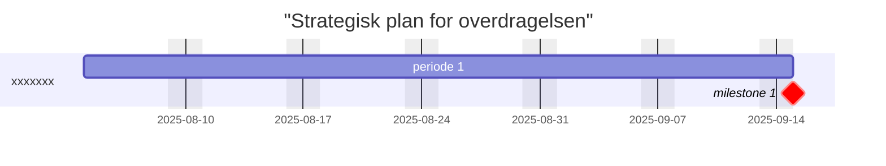
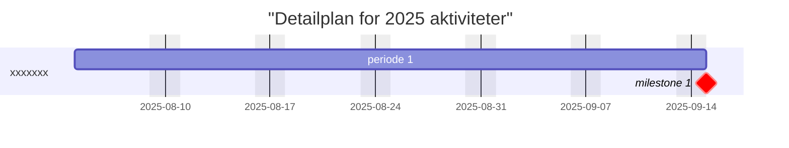

**Baggrund og motivation**

OS2display står ligenu overfor udfordringerne med at fremme udbredelse af det udviklede produkt, øge skalerbarheden og sikre genbrugelighed.
Udvikling og vedligehold af OS2display har indtil ny været koordineret og financieret af Borgmesterens afdeling i Aarhus kommune,  og lagt ud til fri afbenyttelse I OS2's Gihub.
Det er ITKdev fra Aarhus kommune der har stået for både udvikling og vedligehold af kildekode, og Bellcom eller kommunerne selv der har stået for driften.

Nu er der imidlertid så meget interesse for produktet at det er tid til formelt at overdrage både ejerskabet, ansvaret og financieringen til OS2fællesskabet. 
En overdragelse som kræver både fokus, dedikation og opmærksomhed, så den kan skabe præcedens for hvordan man enkelt og smidigt forvandler en myndighedsspecifik leverandørdrevet løsning
til et genbrugelig implementationsneutral OS2 produkt.

**Strategi og målbillede for overdragelsen***

**Plan for overdragelse**

**Milepæle:**

