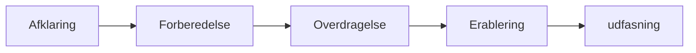
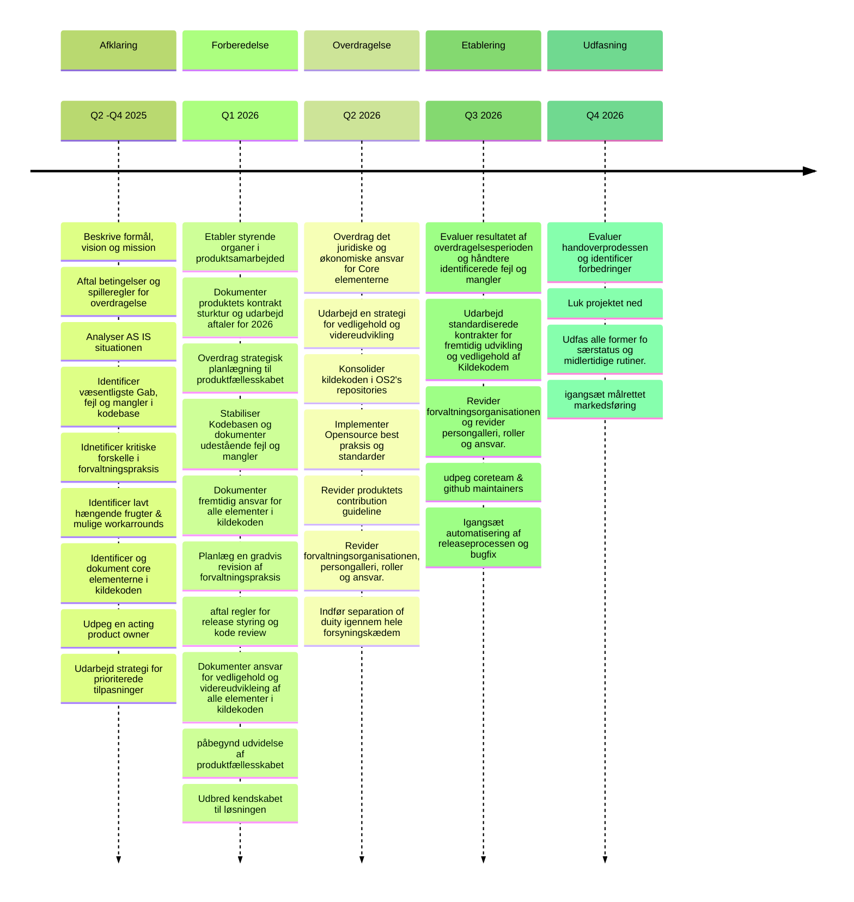

## Baggrund og motivation

OS2display står lige nu overfor udfordringerne med at fremme udbredelse af det udviklede produkt, øge skalerbarheden og sikre genbrugelighed.
Udvikling og vedligehold af OS2display har indtil ny været koordineret og financieret af Borgmesterens afdeling i Aarhus kommune,  og lagt ud til fri afbenyttelse I OS2's Gihub.
Det er ITK-dev fra Aarhus kommune der har stået for både udvikling og vedligehold af kildekode, og Bellcom eller kommunerne selv der har stået for driften.

Nu er tiden imidlertid kommet til formelt at overdrage både ejerskabet, ansvaret og financieringen til OS2 fællesskabet, for derigennem at sikre genbrugelighed og udbredelse.

En sådan overdragelse kræver både fokus, dedikation, opmærksomhed og smasrbejde fra alle sider. Arbejdsprocesserne omkring udvikling og vedligehold skal løftes ud af en myndigheds specifik kontekst og ind i et fælles offentlig økosystem. Koden skal gøres implementations neutral og udviklingsmetodikken skal understøtte OpenSource metodikkerrne for contribution, shared responsibilities og klare exit strategier.  

Lykkes vi med at sikre dette dette vil overdragelsen ikke alene tilføre endnu et robust produkt til OS2 fællesskabets portefølje, den ville også kunne danne præcedens for hvordan man enkelt, hurtigt  og smidigt forvandler en myndighedsspecifik leverandørdrevet løsning
til et genbrugelig implementationsneutral OS2 produkt.

## Strategi og målbillede

Det overordnede mål at sikre en glidende overdragelse af ansvar, ejerskab og beslutningsret, så man undgår at påvirke driftstabilitet, sikkerhedsnuveauet og udbredelseshastigheden negativt.
En overdragelse baseret mere på samarbejde og fælles indsats, end på vidensoverdragelse og kontraktuelle trækasserier. 

Overdragelses planen bygger på et indgående forståelse af nåde Open Source udvikling og produkt overdragelse. Den tager højde for at produktets grundlæggende funktionalitet og kvalitet afspejler behov og krav hos den afgivne kommune og at de kommende anvenderes forventninger er tårnhøje i forhold til generalitet, genbrugelighed og hurtig implementering.

## Omdrejningspunkt og fokus

Overdragelsens fokus er derfor mere på at sikre det bedst mulige resultat for alle end på at kunne udpege hvem der bærer skylden, og derfor skal betale prisen, for misforståelser og fejl. 

Planen er en samarbejdsplan hvor man løbende overdrager roller og ansvar mellem parterne og flittigt dokumenterer strategiske, taktiske og operationelle aftaler, fejltagelser og resultater.

Målet er ikke alene af etablere det bedst mulige forvaltningsregime omkring en genbrugelig anvendelig og billig OpenSource løsning, det er også at OS2 bliver 100 meter mestre i at håndtere transformationen fra myndighedsspecifikke løsninger til nationalt genbrugelige OpenSource produkter.

## Temaer, faser  og aktiviteter

**Overdragelses aktiviteterne er opdelt i fire temaer:**
1. Kontrakt og ejerskab *(Overdragelse af det juridiske ansvar)*
2. Produktfællesskabets styringsmode *(Overdragelse af beslutningskompetence)*
3. Daglig praksis for vedligehold og dokumentation *(overgang til OS2 best practice for vedligehold og dokumentation)*
4. Produktudvikling, modenhed og kvalitet *(overdragelse af kildekode, IPR og produkt ansvar, samt justering af udviklingspraksis)*

For hvert tema handler det om at identificere gabet mellem den faktiske tilstand og målbilleded for OS2 fællesskabet, så man sammen kan aftale hvad der som minimum skal være på plads inden overdragelsen, hvad man justerer undervejs og hvad OS2 skal håndtere selv efter overdragelse. 

Alle aftaler bør fokumenteres i en beslutnings log, således at deres opfyldelses grad og success kan evanlueres under og efter selve overdragelsen.
   
**Hvert tema er bygget op omkring en aktivitetskæde der har følgende faser:**

For hvert Tema ligger der en række fasebestemte aktiviteter, som tilsammen skal være med til at sikre samarbejde, transperans og driftsikkerhed, under hele overdragelsesfasen.
(se herunder fr detaljer)

## Milepæle og tidsperspektiv i overdragelse

Overdragelsesn strategiske milepæle følger kalender- og budget-året

- Forberedelserne til overdragelsen blev påbegyndt i andet kvartal 2025
- Overdragelsesprocessen blev igangsat i 3 kvartal 2025 
- Den juridiske overdragelse sker den 1 Januar 2026
- Hypercare pågår første halvår af 2026
- Phaseout påbegyndes september 2028 og løber året ud
- Overdragelsesprojektet lukkes 30 december 2026

#### Overordnet plan for overdragelsen af os2 display:

  
