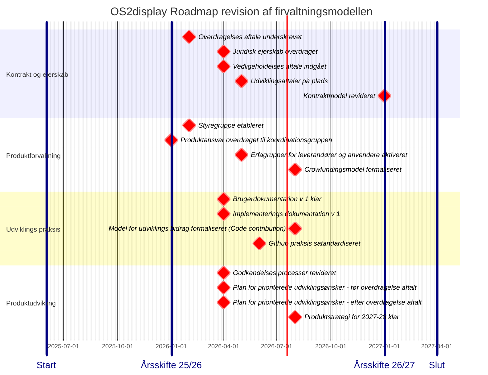

📆 _sidst opdateret: {{ site.time | date: '%B %d, %Y' }}_

# Revision af forvaltningsmodellen i OS2 display

Den startegiske plan for revision af forvaltningsmodellen i OS2display i forbindelse med opstart på den formelle overtagelse af produiktets kildekode.

Planenen følger den strategiske plan for overdargelse af kildekoden 8
Planenen følger den strategiske plan for overdargelse af kildekoden fra Aarhus Kommune til OS2 [JVF: OS2display overdragelse til OS2](https://chatbotberg.github.io/OS2produktmodning/docs/Produktspecifikke-anvisninger/OS2display/OS2display_handover.html)

## Fokus og omdrejningspunkt: Revision af forvaltningsmodellen i OS2 display

**Indsatsområder** (arbejdsstråmme)
1. Kontrakt og ejerskab 
2. Produktfællesskabets styringsmode 
3. Daglig praksis for vedligehold og dokumentation 
4. Produktudvikling, modenhed og kvalitet 

**Målsætning pr indsatsområde**

1. Kontrakt og ejerskab : 
   *Overdragelse af det juridiske ansvar*
   1. Juridisk ejerskab af kontrakt for udvikling og vedligehold af kildekoden skal overdrages fra Borgemesterens afdeling i Aarhus til OS2.
   2. Kontrakten for udvikling og vedligehold skal kunne sendes i offentlig udbud 
   3. Der skal udarbejdes kontrakter som understøtter brug af flere leverandører
2. Produktfællesskabets styringsmodel
   *Overdragelse af beslutningskompetence og forvaltningsansvar*
   1. Der skal etableres en styregruppe
   2. Produktfællesskabet skal have overdraget ansvaret for at identificere og prioritere udviklings og ændringsønsker 
   3. Der skal opbygges samarbejdsfællesskaber for hhv. anvendere, udviklingsleverandører og driftsansvarlige
   4. Der skal indføren en praksis for crowdfunding, strategisk prioritering og tværgående prioritering af kommunespecifikke udviklingsønsker.
3. Praksis for udvikling og dokumentation
   *overgang til OS2 best practice for vedligehold og dokumentation*
   1. Der skal etableres formelle godkendelses og review processer,  i henhold til gældende praksis for Open Source udvikling ( bla. separation og duity)
   2. Der skal etableres et  core-team med ansvar for at kvalitetssikre kildekode og dokumentation
   3. Der skal indføres en praksis for håndtering af frivillige kodebidrag fra anvendere og driftsleverandører
   4. Der skal ryddes op i github og indføres standardiserede rolle og ansvarsmodeller.
4. Produktmodning og videreudvikling
   *overdragelse af kildekode, IPR og produkt ansvar, samt justering af udviklingspraksis*
   1. Ansvaret for at godkende, prioritere, planlægge og igangsætte udviklings aktiviteter skal overdrages til koordinationsgruppen.
   2. Der skal aftaler en reprioritering af igangværende udviklingsinitiativer
   3. Den nyeste version af kildekoden skal gøres implementations uafhængig 
   4. Der skal udarbejdes automatiserede implementations scripts for hele løsningen

