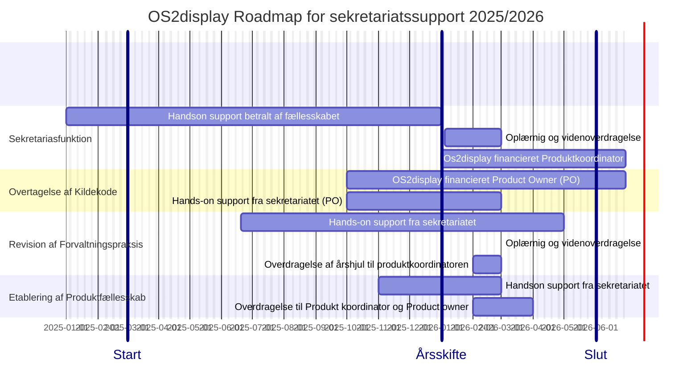

📆 _sidst opdateret: {{ site.time | date: '%B %d, %Y' }}_

# OS2forms: Roadmap og Timeline for sekretariats-support

Sekretariatssupporten til OS2forms kan deles op i fire hovedspor
1. **Sekretariasfunktion**
   - Administration og økonomiopfølgning.
   - Mødeplanlægning og referat skrivning
   - onboarding af nye medlemmer 
   - opdatering af hjemmeside
   - Publisering af referater
   - udarbejdelse af nyhedsbreve
     
2. **Overtagelse af Kildekode** og leverandørsamarbejde
  - Planlægning og gennemførelse af overdragelsesaktiviteter
  - Udarbejdelse overdragelses aftale
  - udarbejdelse og indgåelse af nye kontrakter
    
3. **Revision af forvaltningspraksis** og crowdfunding
    - revision af samarbejdsprocesser
    - identificering af stragegiske indsatsområder
    - udarbejdelse af12 mdr roadmap for produkt udvikling
    - 
4. **Etablering af produktfællesskab**
    - etablering af styringsorganer og mødepraksis
    - Planlægning og afvikling af vidensdeling webinarer
    - planlægning og gernnemførelse af communitymøder og erfagruppemøder (2026)
