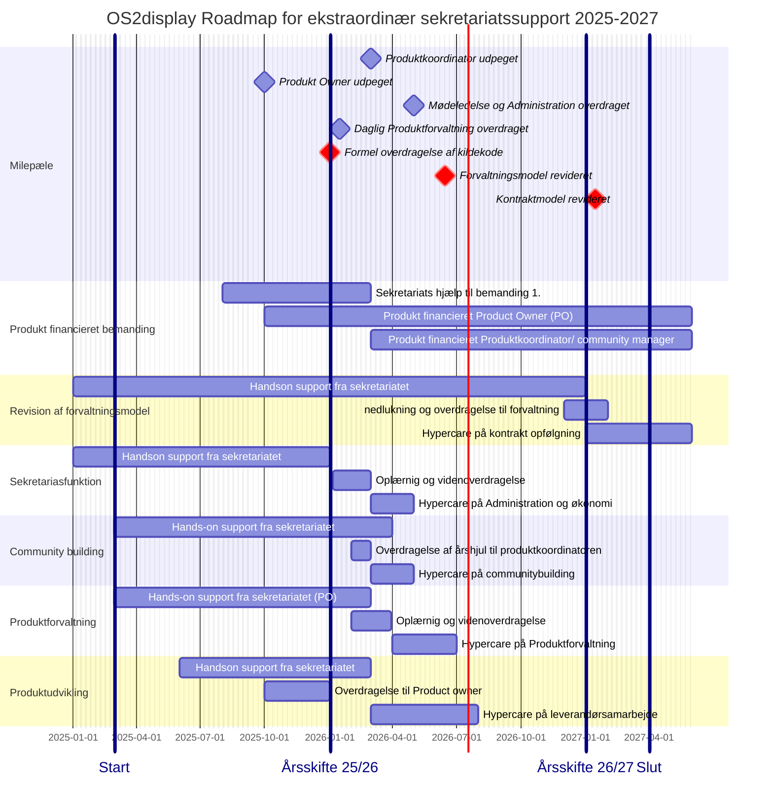

📆 _sidst opdateret: {{ site.time | date: '%B %d, %Y' }}_

# OS2display: Roadmap og Timeline for ekstraordinær sekretariats-support

______________

Den ekstraordinære Sekretariatssupporten til OS2display har til formål at styrke produktsamarbejdet og fremme produktudbredelsen, og har været financieret af OS2 samarbejdet siden 2023.
Den ekstra ordinære indsats vil blive udfaset i løbet af 2027, hvorefter sekretariatsstøtten til OS2display vil fortsætte på lige vilkår med andre OS2produkter.

Den ekstraordinære Sekretariatssupporten der ydes til OS2display 2025-2027 kan deles op flg hovedspor, 

1. Revision af forvaltningsmodel og overtagelse af produktejerskab
2. Sekretariasfunktion og økonomirapportering
3. Community building og communitybuilding
4. Produktforvaltning og vedligehold
5. Produktudvikling og leverandørsamarbejde

Punkt 1 fokuserer på planlægning, organisering og orkestrering af den formelle overdragelse af kildekode og forvaltningsansvar fra Aarhus Kommune tok OS2display produktfællesskabet.
Punkt 2 og 3 handler om administration, kommunikation og communitybuilding, og kan håndteres af en Produktkoordinator eller en Communitymanager med generel AC kompetence
Punkt 4 og 5 handler om produktudvikling, leveralceledelse og leverandørsmarbejde, og kan håndtere af en Product owner som har praktisk erfaring med IT udvikling og vedligehold. 
______________

I forbindelse med udfasningen af den ekstratordinære sekretariatssupport er der brug ofr at OS2 fællesskaber afsætter midler til frikøb af 2 deltidsressorucer:
   1. en Produkt koordinator eller community manager ansvar for Administration, Kommunikation og Koordination 
   2. en Product Owner med ansvar for produktforvaltning og produkt udvikling

OS2 forms vil fortsat modtage support fra sekretariatet, i form af rådgivning, vejledning og praktisk AD-hoc bistand.  
De to identificerede ressorucer vil derudover blive en del af OS2s "korps" af Produkt koordinatorer, communituymanagere og Product Owners, med alt hvad det medførere af vidensdeling, skabelonudveksling og kompetenceopbygning. 
______________

De fire hovedspor i den tildelte sekteratiats support har dækker over flg kerneaktiviteter

1. **Overtagelse af produktejerskab** og revision af forvaltningsmodel
- udarbejdesls af overdragelses aftale (incl forhandling)
- Etablering af roadmap og milepælsplan for overdragelse
- Planlægning, koordinering, monitorering og rapportering af overdragelsesaktiviteterne
- udarbejdelse af leverandør aftaler & ski kontrakter
  *for detaljer henvises der til den udarbejdede plan for revision af forvaltningsmodellen [link]*

   
3. **Sekretariasfunktion** og økonomirapportering
- Administration og økonomiopfølgning
- Mødeplanlægning og referat skrivning
- administrativ onboarding af nye medlemmer
- opdatering af hjemmeside
- Publisering af referater

4. **Community building** og crowdfunding
- udarbejdelse af nyhedsbreve
- afvikling af webinarer og introforløb
- etablering af styregruppe
- Etablering af årshjul og mødepraksis for Styregruppe og Koordinationsgruppe
- Etablering af årshjul og praksis for Communitymøder
- Etablering afårshjul og praksis for Brugerklub møder ( anvendere)
- Etablering af årshjul og praksis for teknisk erfagruppemøder (kommunale driftsafdelinger og drifts leverandører)
- Etablering af crowfundings model

        
5. **Produktforvaltning** og leverandørsamarbejde
- udarbejdels af process beskrivelser
- revision af contribution guidelines
- Etablering af beslutningslog
- Etablering af Leverandør samarbejde
- sikring af Transperans og sporbarhed i leverancen
- Etablering af escaleringsmodel for fejl og mangler i leverancen
- Etablering af praksis for overtagelse af Contributions
- Etablering af praksis for tværgående leverandørsamarbejde
- Etablering årshjul og praksis for leverandøropfølgning

      
6.  **Produktudvikling** og vedligehold af Kildekode
- udarbejdelse af produktbeskrivelse og udbedring af dokumentation
- Udarbejdelse af element oversigt og core definition
- Releasemanagement & Bugfix håndtering ( optimering & opstramning incl 12 måbneders roadmap)
- Etablering af transperat issuetrackingen i github
- Udarbejdelse af 12 mdr roadmap for Vedligehold og sikkerhedsopdateringer
- Udarbejdelse af 12 mdr roadmap for feature udvikling

