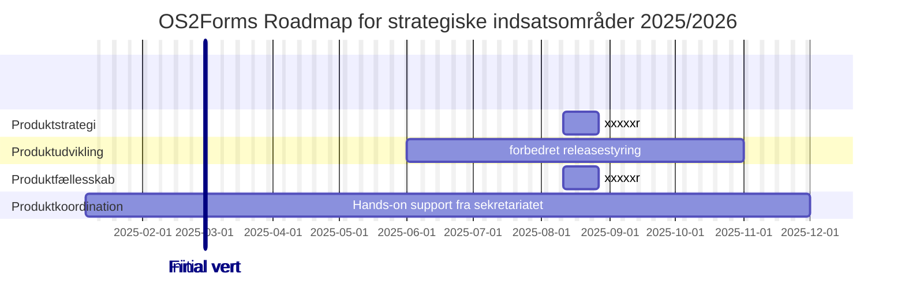

---

📆 _sidst opdateret: {{ site.time | date: '%B %d, %Y' }}_

# OS2forms: Roadmap og Timeliene for de strategisk indsatsområder

Nedenstående diagram er en anbefaling til hvilke aktiviteter der igangsættes inden forhver af de fire strategiske hovedspor i løbet af 2025 & 2026. 

**De 4 Hovedspor er flg:
1. **Produktstrategi** og udbredelse
2. **Produktudvikling** og vedligehold
3. **Produktfællesskab**,  engagement og inolvering
4. **Produktkoordination**, administration og kommunikation

