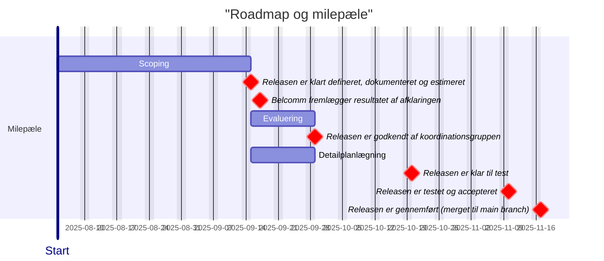

**Milepæle:**
- xx.xx.2025 
- 

```mermaid
gantt
    dateFormat  YYYY-MM-DD
    title       "Roadmap og milepæle"
    excludes    weekends
    tickInterval 1week
    %% (`excludes` accepts specific dates in YYYY-MM-DD format, days of the week ("sunday") or "weekends", but not the word "weekdays".)

    section Milepæle
    Start                                                       : vert, v1, 2025-08-04, 
    Scoping                                                    :des1, 2025-08-04, 2025-09-15
    Releasen er klart defineret, dokumenteret og estimeret     :crit, milestone, a2,2025-09-15, 0d
    Belcomm fremlægger resultatet af afklaringen               :crit, milestone, a3,2025-09-17, 0d
    Evaluering                                                 :des2, 2025-09-15, 2025-09-29
    Releasen er godkendt af koordinationsgruppen               :crit, milestone, a4,2025-09-29, 0d
    Detailplanlægning                                          :des2, 2025-09-15, 2025-09-29
    Releasen er klar til test                                  :crit, milestone, a5,2025-10-20, 0d
    Releasen er testet og accepteret                          :crit, milestone, a6,2025-11-10, 0d
    Releasen er gennemført (merget til main branch):crit, milestone, a5,2025-11-17, 0d

```
