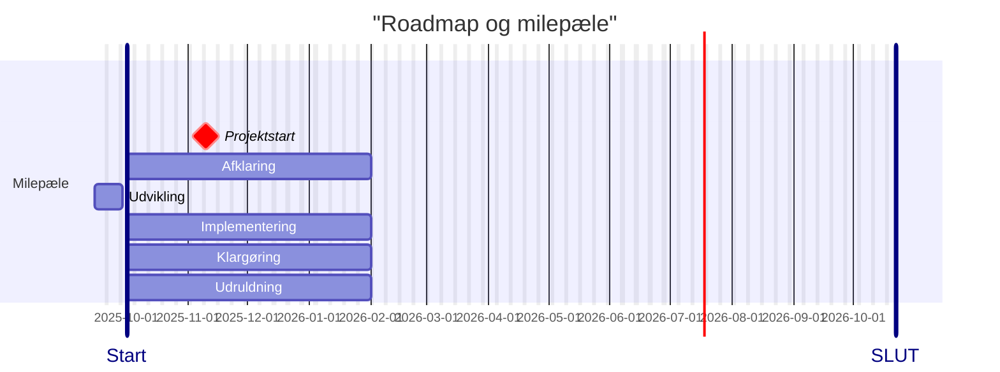

# Etablering af OS2forms integration til fordelingskomponenten

OS2forms koordinations og styregruppe besluttede i efteråret at igangsætte udvikling og implementering af en OS2forms‑integration til KOMBITs fordelingskomponent. 
Hovedformålet med etablering af en sådan komponeent var at effektivisere datahåndtering og muliggøre udfasning af de anvendte 3 parts selvbetjeningsløsninger.

Etablering af OS2forms integrationen kan deles op i 5 hovedfaser, med hver sit fokus og omdrejningspunkt.

1. **Afklaring** og afgrænsning.
2. **Udvikling** og test
3. **Implementering** i 3 test kommuner.
4. **Klargøring** og dokumentation
5. **Udruldning** og idriftsættelse

**Milepæle:**
- 08.10.2025: projektet bliver fremlagt for  Styregryppen
- 10.11.2025: Styregruppen beslutter at igangsætte projektetet.
- 

