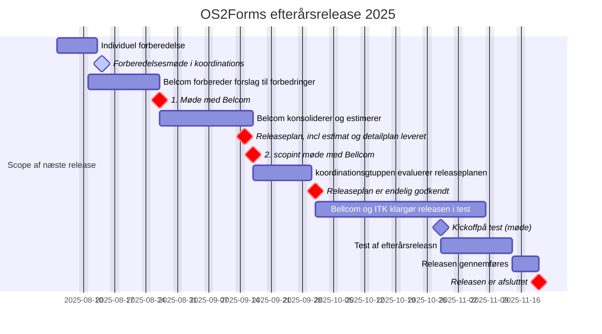

**Seneste revision af releasplanen er som flg:**
- 27.08.2025: 1.scopingmøde med Bellcom
- 17.09.2025: 2 scopingmøde med Bellcom 
- 15.09.2025: Releasen er klart defineret, dokumenteret og estimeret
- 01-10-2025:  Releasen blev  godkendt af koordinationsgruppen  (forsinket 2 arbejdsdage)
- 28.10.2025: Releasen er klar til test ( forsinket 5 arbejdsdage)
- 29.10.2025 : Kickoff på test /Virtuel møde med Bellcom kl 10.00 – 11.00
- 14.11.2025: Releasen er testet og accepteret (udskudt 4 arbejdsdage)
- 20.11.2025: Releasen er gennemført (merget til main branch)  ( udskudt 3 arbejdsdage)

**Baggrund for forsinkelser og udskydelser**:

- Den forsinkede godkendelse af scope resulterede desværre i at ITK – Aarhus ikke fik færdiggjort klargøring af de identificerede bugfix inden deres udviklere gik på planlagt efterårsferie.
- Bellcom kan naturligvis ikke ikke færdiggøre testen før ITK har færdiggjort dette arbejde.
- ITK har  allokeret ressourcer til at få deres arbejde afsluttet på mandag, men der løber Bellcom ind i planlagt ferie hos deres udviklere, hvilket betyder at de først kan færdiggøre den sidste del af arbejdet i starten af uge 44. 

**Kickoff møde:**

For at sikre fokus og kvalitet for teste er det planlagte leverandørmøde med Bellcom den 29 oktober erstattet med et Kickoff møde på test.
Alle de kommuner der er repræsenteret i koordinationsgruppen er blevet bedt om at sende en testansvarlig/testkoordinator til dette møde. 

Mødeinvitation er sendt til koordinationsudvalget, med note om at de selv skal videresende til rette vedkommende. 

