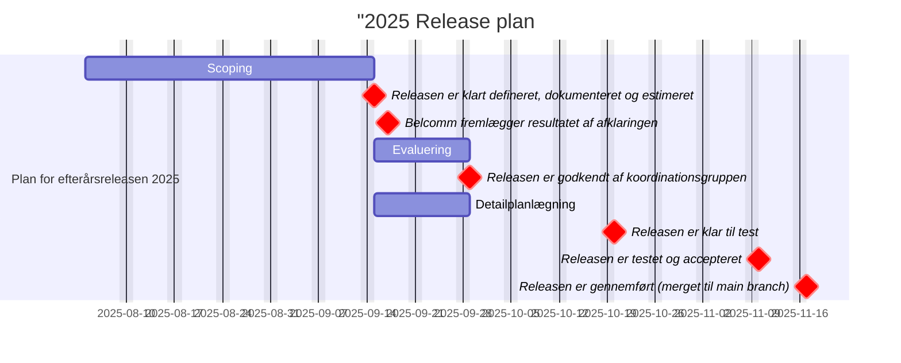

**Milepæle:**
- 15.09.2025: Releasen er klart defineret, dokumenteret og estimeret
- 29.09.2025: Releasen er godkendt af koordinationsgruppen
- 20.10.2025: Releasen er klar til test
- 10.11.2025: Releasen er testet og accepteret
- 17.11.2025: Releasen er gennemført (merget til main branch i kildekoden)

