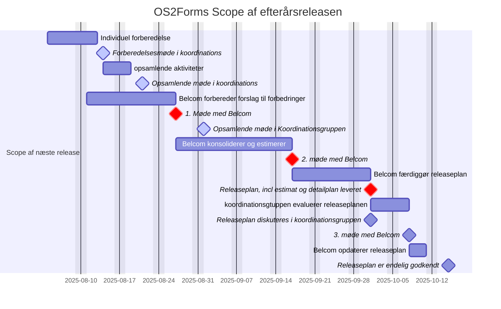

xxxx
xxxxx
xxxxx

```mermaid
gantt
    dateFormat  YYYY-MM-DD
    title       OS2Forms Scope af efterårsreleasen
    excludes    weekends
    tickInterval 1week
    %% (`excludes` accepts specific dates in YYYY-MM-DD format, days of the week ("sunday") or "weekends", but not the word "weekdays".)

    section Scope af næste release
    Individuel forberedelse                        :des1, 2025-08-04, 2025-08-13
    Forberedelsesmøde i koordinations              :active, milestone, a2, 2025-08-14, 0d
    opsamlende aktiviteter                         :des2, after a2,3d
    Opsamlende møde i koordinations                :active, milestone, a3, 2025-08-21, 0d
    Belcom forbereder forslag til forbedringer     :2025-08-11, 2025-08-27
    1. Møde med Belcom                             :crit, milestone, a3, 2025-08-27, 0d
    Opsamlende møde i Koordinationsgruppen         :active, milestone, a4, 2025-09-1, 0d
    Belcom konsoliderer og estimerer                 :des3, after a3,2025-09-17
    2. møde med Belcom                             :crit, milestone, a5,2025-09-17, 0d
    Belcom færdiggør releaseplan                   :des4, after a5, 10d
    Releaseplan, incl estimat og detailplan leveret:crit,milestone, a6, after des4, 0d
    koordinationsgtuppen evaluerer releaseplanen   :des5, after a6, 5d
    Releaseplan diskuteres i  koordinationsgruppen :milestone, a7, 2025-10-01, 0d
    3. møde med Belcom                             :milestone, a8,2025-10-08, 0d
    Belcom opdaterer releaseplan                    :des6, after a8, 3d
    Releaseplan er endelig godkendt                :milestone, a9,2025-10-15, 0d

```