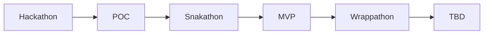

---

📆 _sidst opdateret: {{ site.time | date: '%B %d, %Y' }}_

# Open Source Healthanalyzer

Herunder findes en række anbefalinger til hvordan mN kommer i gang med etablering af en open-source helath analyzer på en effektiv, iterativ og målrettet måde.

Anbefalingerne tager udgagnspunkt det arbejde der er igangsat i OS2 for at understøtte både egne og andres mulighed for at vurdere open-source produkters modehed på en kvantitativ, effektiv og indiskutabel måde.

- **Anbefalingerne tager udgangspunkt i at man anvenderde gense betingelser for at kategorisere software som open-source**
- **Målingerne er baseret på automatiseret dataindsamling og kvalitetsbærende metrikker**
- **Processen er bygget op omkring open-source metodik og praksis for afklaring, udvikling og implementering**

## Hvorfor skal vi have en Health Analyzer og hvad skal den bruges til 

Ideen til at implementere Open-Source Healthanalyser udspringer af flg:

Behovet for let at kunne evalueret:
- produktfællesskabets aktivitetsniveau og engagement
- produktudviklingsprocessens stabilitet, sikkerhed og transperans
- kildekodens aktualitet kvalitet og compliance
- produktets anvendelse af open-source standarder og bestpraksis. 

Tidligere erfaringer med selvevalueringeringer og ekspertvurderinger så som:
- de er tidskrævende og omkostningstunge
- de er udtryk for et øjebliksbillede
- de kan ikke eftervises kvantitativt
- de er ikke nødvendigvis hverken upartiske og absolut retvisende

Ønsket og at få værktøj der kontinuerligt kan bruges til at vurdere "helbredstilstanden" på:
- OS2's produkt portefølje
- Open-source produkter som anvendes i dansk offentlig sektor
- Open-source upstream komponenter som kunne være af interesse for den danske offentlige sektor

## Arkitektur, løsningsdesign og software komponenter

 principper, arkitektur og gevinstpotentiale bag healthanaluzeren firnder du her: 
[https://janhalen.github.io/enterprise-architecture-patterns/proposals/2025-10-02-health-analyzer.html](https://janhalen.github.io/enterprise-architecture-patterns/proposals/2025-10-02-health-analyzer.html)-

## Process for afklaring, afprøvning og afgrænsning.

Processen for afklaring afprævning og afgræning af hvad en healthanalyzer skal måle og hvordan den skal gøre det, er bygget op omkring flg grundprincipper:
- Løsningen skal baseres på anvendelse af modne open-source upstream produkter med velfungerende communities
- løsningen skal afprøves i laboratorie test (POC) og mindre skala (MVP) inden man lægger sig fast på et endeligt produktdesign (TBD)
- afklaringsprocessen skal være kort, iterativ, descriptiv og afklarende.

Så snart der er identificeret en/ eller flere valid(e) kandidat(er) der kan danne grundlag for løsningen går man igang med den inkrementielle afprøvning.

Processen skal danne grundlaget for at  der kan træffes en beslutning om strategi, struktur og vision for det produktdesign, driftsmiljø og udbredelse. 
Udvikling, afklaring og afgrænsning, diskuteres, dokumenteres og effektueres i OS2's sandkassemiljø og omfatter 5 indledende trin for afklaring, afprøvning og afgrænsning.

De **5 Indledende trin for afklaring, afprøvning og afgrænsning er :**
1. ***Hackaton*** : en udviklings workshhop hvor man får skabt fungerende arkiktektur, workflow og grænseflade for at kunne hente og præsentere målinger (data)
2. ***POC*** : resultatet af Hackaton spundet op i et test miljø der kan danne grundlag for den videre idegenerering
3. ***Snakaton***: en afklarings workshop hvor man får defineret og raffineret de metrikker der skal måles på, og de rapporter og dashboards der skal stilles til rådighed under MVP'en
4. ***MVP***: et afprøvningsprojekt hvor sætter løsningen i drift i et beskyttet miljø  for at afprøve funktionalitet og anvendelighed i "det virkelige liv"  
5. ***Wrappathon***: en dokumentations workshop hvor man beskriver de erfaringer der er med 

Til sammen sikre de ovenstående 5 trin at man får testet et løsningsforslags evne til at understøtte visionen om en Healthanalyzer, og skabt beslutningsgrundlaget bag den endelige produktvision.

Det samlede forløb omkring etablering af en generisk og genanvendelig healthanalyze handler om at skabe den fornødne viden til at man kan beslutte fremtiden for det afprøvede løsningsforslag. 
Fasen er i figure herunder navngivet som **TBD** og har følgende udfaldsrum:
- løsningen skrottes fordi den ikke er skalerbar, håndterbar, økonomisk rentabel eller anvendelig i det lange løb.
- løsningen videreudvikles, rafineres og produktionsmodnes med de eksisterende metrikker
- løsningen udvides med yderligere metrikker og der etableres en en produktionsklar version 1
   
**Det samlede flow ser således ud**

Sammenholder man disse med [CNCF's modenhedsmodel](https://www.cncf.io/project-metrics/) svarer det til at:
- de 3 første faser foregår i sandkassemiljøet hvor man afprøver ideer og lager geniealiteterne blomstre frit,
- de næster 2 faser betyder at produktet er under Inkubering hvor man nurser og superviserer tilblivelsen af et genbrugeligt produkt

Det er først herefter man har et velunderbygget og bæredygtigt grundlag for at lægge en strategi for Produkt etablering, modning og udbredelse.

For detaljer om de fem indledende trin, deres formål, omfang, udbyttr og grundlæggende struktur og henvises til ***flg undersider*** ( en for hver)

## Ressourceforbrug og driftsomkostninger

Når man er igang med at etablere et nyt produkt er det vigtig at vide hvornår man rammer *Return of Investment (ROI)* og hvad *Total Cost Of Ownership (TCO)* er. 
Begge dele hænger imidlertid sammen med hvilken løsning der er man reelt ønsker at gå med, når man er færdig med at afklare, afprøve og afgrænse produkt ideen.

Det er dog den gense erfaring at man gennem løbende POC afprøvning og MVP implementering skaber det bedst mulige grundlag for at kunne vurdere de reelle gevinstpotentialer og samlede omkostninger for en given løsning 
inden man påbegynder tilpasning, produktionsklargøring og idriftsættelse. 

Man bør derfor hurtigst muligt, og så omkostningsneutralt som munligt sikre sig et solidt overblik over hvad der skal til for at etablere en stabil, genbrugelig og skalerbar løsning, hvor udgifter til drift og vedligehold ikke 
skalerer fornuftigt i takt med at løsningen udbredes. 

**Der skal være råd til at skrotte løsningen når MVP'en er afsluttet** 

Traditionelt set har man den indledende periode ofte været så omkostningstung og omfattende at det har været nærmest umuligt at trække stikket og skrotte ideen når afprøvningen var ovre. 
Grunder er som regel at man har udvilket og afprøvet en fuldskala løsning i sandkassen, og sat denne i drift med det samme, uden at forholde sig til behovet for inkubering/modning  og produktionskalgøring. 

For at undgå dette bør man lave en enklere, lettere og mere eksplorativ process, hvor man tester forskellige Open-Source upstream komponenter af i forhold til anvendelinghed, egnethed og tilgængelighed,
ved at afprøve dem i et test set op (POC) og implementere dem i et minimums set op (MVP).

Ressourceforbrugt til afprøvning af en given løsning bør derfor som udgangspunkt være under 1/10 af hvad det vil koste at udvikle en produktionsklar veersion af løsningen, 
så det bliver være økonomisk acceptabel at skritte løsningen efter MVP'en hvis det viser sig at der er en 

**Ressourceforbrug under afklaring, afprøvning og afgrænsning**

De **5 Indledende trin for afklaring, afprøvning og afgrænsning er :**

1. ***Hackaton***
   Den indledende Hackaton er en workshop af 1-2 dages varrighed, der kræver deltagelse fra .... ( se detaljer her)

   Workshoppen kan afvikles på 3 forskellige måder:
   - en lille lukket workshop hvor der indgåes timeaftale med de deltagende parter.
   - en åben workshop workshop hvor 3-5 leverandører inviteres til at deltage i workshoppen med kvalificerede ressourcer 
   - et Weekend Hackaton hvor det danske OpenSource miljø inviteres til at deltage i to dages intensit hackaton.

     ***Den lukkede workshop***
     En to dages workshop på ialt 10 timer incl frokost

     8 Deltagere:
     - Arbejdsgruppens medlemmer (6 personer)- som varetager flg funktioner
        - Arkitekt
        - Facilitator
        - Forretningsudvilkere
     - Kommetcielle aktører ( 2 personer)
        - 1 platforms engineer
        - 1 data Pipeline-udvikler
     
     Udgiftsposter:
     -  25 timer pr deltager - (10 til workshop & 15 til forberedelse og efterbehandling
         - 0 kr for arbejdsgruppens medlemmer
         - 50.000 - 75.000 for Kommercielle leverandører 
     -  Transport, overnatning og 1 gange aftensmad til 4-6 personer
         -  12.000 - 18.000 KR
     -  Frokost forplejning til gruppen
        -   1.500 - 2.000 KR
     -   Licens, hardware og hosting
         -   0 kr (bring youe own device + soinsorat fra OS2)

     ***Den åbne workshop***
       15-25 Deltagere:
     - Arbejdsgruppens medlemmer (6 personer)- som varetager flg funktioner
        - Arkitekt
        - Facilitator
        - Forretningsudvilkere
     - Kommetcielle aktører (3-5 leverandører, forventeligt 2 deltagere pr leverandør)
        - 1 platforms engineer
        - 1 data Pipeline-udvikler
     Udgiftsposter:
      Deltagelse i 2 hele dage
         - 0 kr for arbejdsgruppens medlemmer
         - 75.000 - 125.000 for Kommercielle leverandører  (Fast honorar pr leverandør svarende til 25 timer a 1000 kr)
     -  Transport, overnatning og 1 gange aftensmad til Arbejdsgruppens medlemmer
         -  12.000 - 18.000 KR
     -  Frokost forplejning til gruppen
        -   4.500 - 8.000 KR
     -   Licens, hardware og hosting
         -   0 kr (bring youe own device + soinsorat fra OS2)

     ***Weekend Hackaton***
     Intet honorar men tilgengæld meget facilitering og forplejning, samt et indlæg fra et stort navn.
     Deltagere
     - Arbejdsgruppens 6 medlemmer
     - Facilitator og arrangeør af mødet
     - Opdragsholder ( Honorar)
     - 25 - ? Deltagere
     
        Udgiftsposter:
      Deltagelse i 1 heldags workshop
         - 0 kr for arbejdsgruppens medlemmer
         - 0 kr for workshop deltagerne
         - X for Facilitering og leje af lokale
         - X for foredragsholder
     -  Transport, overnatning og 1 gange aftensmad til Arbejdsgruppens medlemmer
         -  12.000 - 18.000 KR
     -  Lokaler Frokost forplejning til gruppen
        -  Afhænger af antal deltagere ca 600 -700 pr deltager
        -  Lokale leje 
     -   Licens, hardware og hosting
         -   0 kr (bring youe own device + soinsorat fra OS2)

3. ***POC***  

4. ***Snakaton*** 

5. ***MVP***

 https://www.stackhero.io/en-US/services/GitLab/pricing

7. ***Wrappathon***

**NB!**
- Ressourceforbruget der går forud for de 5 trin for afklaring, afprøvning og afgrænsning afhænger helt og holdent af hvordan ideen er opstået, og om der er tale om  og vil derfor ikke blive behandlet yderligere her. 
- Ressourceforburget der kræves for at tilpasse, produktionsmodne og udbrede produktet afhænger af hvordan afklaring, afprøvning og afgrænsning er gået og hvordan man ønsker den videre process skal være. Dette ressourceforbrug vil derfor heller ikke blive berørt yderligere her. 

