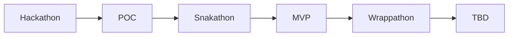

---

📆 _sidst opdateret: {{ site.time | date: '%B %d, %Y' }}_

# Open Source Healthanalyzer

Herunder finder du en række anbefalinger til hvordan du kommer i gang med etablering af en open-source helath analyzer på en effektiv, iterativ og målrettet måde.

Anbefalingerne tager udgagnspunkt de strategier det arbejde der er igangsat i OS2 for at understøtte både egne og andres mulighed for at vurdere Opensource produkters modehed på en kvantitativ, effektiv og indiskutabel måde.

- **Anbefalingerne tager udgangspunkt i at man anvenderde gense betingelser for at kategorisere software som open source**
- **Målingerne er baseret på automatiseret dataindsamling og kvalitetsbærende metrikker**
- **Processen er bygget op omkring opensource metodik og praksis for afklaring, udvikling og implementering**

## Hvorfor skal vi have en Health Analyzer og hvad skal den bruges til 

Ideen til at implementere Open-Source Healthanalyser udspringer af flg:

Behovet for let at kunne evalueret:
- produktfællesskabets aktivitetsnuveau og engagement
- produktudviklingsprocessens stabilitet, sikkerhed og transperans.
- kildekodens aktualitet kvalitet og compliance
- produktets anvendelse af OpenSource standarder og bestpraksis. 

Blanddede erfaringer med selvevalueringeringer og ekspertvurderinger så såm:
- de er tidskrævende og omkostningstunge
- de er udtryk for et øjebliksbillede
- de kan ikke eftervises kvantitativt
- de er ikke nødvendigvis hverken upartiske og absolut retvisende

Ønsket og at få værktøj der kontinuerligt kan bruges til at vurdere "helbredstilstanden" på:
- OS2's produkt portefølje
- OpenSource produkter som anvendes i dansk offentlig sektor
- OpenSource komponenter som kunne være af intersse for dansk offentlig sektor

## Arkitektur, løsningsdesign og software komponenter

 principper, arkitektur og gevinstpotentiale bag healthanaluzeren firnder du her: 
[https://janhalen.github.io/enterprise-architecture-patterns/proposals/2025-10-02-health-analyzer.html](https://janhalen.github.io/enterprise-architecture-patterns/proposals/2025-10-02-health-analyzer.html)-

## Process for afklaring, afprøvning og afgrænsning.

Processen for afklaring afprævning og afgræning af hvad en healthanalyzer skal måle og hvordan den skal gøre det nu og i fremtiden er bygget op omkring flg grundprincipper:
- Løsningen skal baseres på modne OpenSource upstream produkter med velfungerende communities
- løsningen skal afprøves i laboratorie test (POC) og mindre skala (MVP) inden man lægger si fast på et endeligt produkt design (TBD)
- afkalringsprocessen skal være iterativ, descriptiv og legende.

så snart der er identificeret en/ eller flere valid(e) kandidat(er) der kan danne grundlag for løsningen går man igang med den inkrementielle afprøvning.
En process der foregår i et snadkassemiljø og som består af 5 indledende trin, der tilsammen skal danne grundlaget for at man kan beslutte sig for hvordan det endelige produkt ser ud.

De **5 Indledende trin for afklaring, afprøvning og afgrænsning er :**
1) ***Hackaton*** : en udviklings workshhop hvor man får skabt fungerende arkiktektur, workflow og grænseflade for at kunne hente og præsentere målinger (data)
2) ***POC*** : resultatet af Hackaton spundet op i et test miljø der kan danne grundlag for den videre idegenerering
3) ***Snakaton***: en afklarings workshop hvor man får defineret og raffineret de metrikker der skal måles på, og de rapporter og dashboards der skal stilles til rådighed under MVP'en
4) ***MVP***: et afprøvningsprojekt hvor sætter løsningen i drift i et beskyttet miljø  for at afprøve funktionalitet og anvendelighed i "det virkelige liv"  
5) ***Wrappathon***: en dokumentations workshop hvor man beskriver de erfaringer der er med 

Til sammen udgør disse 5 trin afklarings, afprøvnings og afgrænsningsfasen, der sikre at man får testet et givent set op i forhold til få veldefinerede metrikker, og får skabt grundlag for en eventuel videre udvikling. 
Det samlede forsøb afsluttes med.... TBD ....som enten betyder at løsningen skrottes, raffineres eller videreudvikles- alt afhængig af hvilke erfaringer man har gjort sig under vejs. 

**Det samlede flow ser således ud**

Sammenholder man disse med [CNCF's modenhedsmodel](https://www.cncf.io/project-metrics/) svarer det til at:
- de 3 første faser foregår i sandkassemiljøet hvor man afprøver ideer og lager geniealiteterne blomstre frit,
- de næster 2 faser betyder at produktet er under Inkubering hvor man nurser og superviserer tilblivelsen af et genbrugeligt produkt

Det er først herefter man har et velunderbygget og bæredygtigt grundlag for at lægge en strategi for Produkt etablering, modning og udbredelse.

For detaljer om de fem indledende trin, deres formål, omfang, udbyttr og grundlæggende struktur og henvises til ***flg undersider*** ( en for hver)

## Ressourceforbrug og driftsomkostninger

Når man er igang med at etablere et nyt produkt er det vigtig at vide hvornår man rammer *Return of Investment (ROI)* og hvad *Total Cost Of Ownership (TCO)* er. 
Begge dele hænger imidlertid sammen med hvilken løsning der er man reelt ønsker at gå med, når man er færdig med at afklare, afprøve og afgrænse produkt ideen.

Det er dog den gense erfaring at man gennem løbende POC afprøvning og MVP implementering skaber det bedst mulige grundlag for at kunne vurdere de reelle gevinstpotentialer og samlede omkostninger for en given løsning 
inden man påbegynder tilpasning, produktionsklargøring og idriftsættelse. 

Man bør derfor hurtigst muligt, og så omkostningsneutralt som munligt sikre sig et solidt overblik over hvad der skal til for at etablere en stabil, genbrugelig og skalerbar løsning, hvor udgifter til drift og vedligehold ikke 
skalerer fornuftigt i takt med at løsningen udbredes. 

**Der skal være råd til at skrotte løsningen når MVP'en er afsluttet** 

Traditionelt set har man den indledende periode ofte været så omkostningstung og omfattende at det har været nærmest umuligt at trække stikket og skrotte ideen når afprøvningen var ovre. 
Grunder er som regel at man har udvilket og afprøvet en fuldskala løsning i sandkassen, og sat denne i drift med det samme, uden at forholde sig til behovet for inkubering/modning  og produktionskalgøring. 

For at undgå dette bør man lave en enklere, lettere og mere eksplorativ process, hvor man tester forskellige Open-Source upstream komponenter af i forhold til anvendelinghed, egnethed og tilgængelighed,
ved at afprøve dem i et test set op (POC) og implementere dem i et minimums set op (MVP).

Ressourceforbrugt til afprøvning af en given løsning bør derfor som udgangspunkt være under 1/10 af hvad det vil koste at udvikle en produktionsklar veersion af løsningen, 
så det bliver være økonomisk acceptabel at skritte løsningen efter MVP'en hvis det viser sig at der er en 

**Ressourceforbrug under afklaring, afprøvning og afgrænsning**

De **5 Indledende trin for afklaring, afprøvning og afgrænsning er :**

1) ***Hackaton***  

2) ***POC***  

3) ***Snakaton*** 

4) ***MVP***

5) ***Wrappathon***

**NB!**
- Ressourceforbruget der går forud for de 5 trin for afklaring, afprøvning og afgrænsning afhænger helt og holdent af hvordan ideen er opstået, og om der er tale om  og vil derfor ikke blive behandlet yderligere her. 
- Ressourceforburget der kræves for at tilpasse, produktionsmodne og udbrede produktet afhænger af hvordan afklaring, afprøvning og afgrænsning er gået og hvordan man ønsker den videre process skal være. Dette ressourceforbrug vil derfor heller ikke blive berørt yderligere her. 

