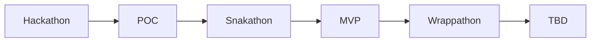

---

📆 _sidst opdateret: {{ site.time | date: '%B %d, %Y' }}_

# Open Source Healthanalyzer

Herunder findes en række anbefalinger til hvordan mN kommer i gang med etablering af en open-source helath analyzer på en effektiv, iterativ og målrettet måde.

Anbefalingerne tager udgagnspunkt det arbejde der er igangsat i OS2 for at understøtte både egne og andres mulighed for at vurdere open-source produkters modehed på en kvantitativ, effektiv og indiskutabel måde.

- **Anbefalingerne tager udgangspunkt i at man anvenderde gense betingelser for at kategorisere software som open-source**
- **Målingerne er baseret på automatiseret dataindsamling og kvalitetsbærende metrikker**
- **Processen er bygget op omkring open-source metodik og praksis for afklaring, udvikling og implementering**

## Hvorfor skal vi have en Health Analyzer og hvad skal den bruges til 

Ideen til at implementere Open-Source Healthanalyser udspringer af flg:

Behovet for let at kunne evalueret:
- produktfællesskabets aktivitetsniveau og engagement
- produktudviklingsprocessens stabilitet, sikkerhed og transperans
- kildekodens aktualitet kvalitet og compliance
- produktets anvendelse af open-source standarder og bestpraksis. 

Tidligere erfaringer med selvevalueringeringer og ekspertvurderinger så som:
- de er tidskrævende og omkostningstunge
- de er udtryk for et øjebliksbillede
- de kan ikke eftervises kvantitativt
- de er ikke nødvendigvis hverken upartiske og absolut retvisende

Ønsket og at få værktøj der kontinuerligt kan bruges til at vurdere "helbredstilstanden" på:
- OS2's produkt portefølje
- Open-source produkter som anvendes i dansk offentlig sektor
- Open-source upstream komponenter som kunne være af interesse for den danske offentlige sektor

## Arkitektur, løsningsdesign og software komponenter

 principper, arkitektur og gevinstpotentiale bag healthanaluzeren firnder du her: 
[https://janhalen.github.io/enterprise-architecture-patterns/proposals/2025-10-02-health-analyzer.html](https://janhalen.github.io/enterprise-architecture-patterns/proposals/2025-10-02-health-analyzer.html)-

## Process for afklaring, afprøvning og afgrænsning.

Processen for afklaring afprævning og afgræning af hvad en healthanalyzer skal måle og hvordan den skal gøre det, er bygget op omkring flg grundprincipper:
- Løsningen skal baseres på anvendelse af modne open-source upstream produkter med velfungerende communities
- løsningen skal afprøves i laboratorie test (POC) og mindre skala (MVP) inden man lægger sig fast på et endeligt produktdesign (TBD)
- afklaringsprocessen skal være kort, iterativ, descriptiv og afklarende.

Så snart der er identificeret en/ eller flere valid(e) kandidat(er) der kan danne grundlag for løsningen går man igang med den inkrementielle afprøvning.

Processen skal danne grundlaget for at  der kan træffes en beslutning om strategi, struktur og vision for det produktdesign, driftsmiljø og udbredelse. 
Udvikling, afklaring og afgrænsning, diskuteres, dokumenteres og effektueres i OS2's sandkassemiljø og omfatter 5 indledende trin for afklaring, afprøvning og afgrænsning.

De **5 Indledende trin for afklaring, afprøvning og afgrænsning er :**
1. ***Hackaton*** : en udviklings workshhop hvor man får skabt fungerende arkiktektur, workflow og grænseflade for at kunne hente og præsentere målinger (data)
2. ***POC*** : resultatet af Hackaton'net spundet op i et midlertidigt miljø der kan danne grundlag for den videre ide-generering
3. ***Snakaton***: en afklarings workshop hvor man får defineret og raffineret de metrikker der skal måles på, og de rapporter og dashboards der skal stilles til rådighed under MVP'en
4. ***MVP***: et afprøvningsprojekt hvor sætter løsningen i drift i et beskyttet miljø  for at afprøve funktionalitet og anvendelighed i "det virkelige liv"  
5. ***Wrappathon***: en dokumentations workshop hvor man beskriver de erfaringer der er med 

Til sammen sikre de ovenstående 5 trin at man får testet et løsningsforslags evne til at understøtte visionen om en Healthanalyzer, og skabt beslutningsgrundlaget bag den endelige produktvision.

Det samlede forløb omkring etablering af en generisk og genanvendelig healthanalyze handler om at skabe den fornødne viden til at man kan beslutte fremtiden for det afprøvede løsningsforslag. 
Fasen er i figure herunder navngivet som **TBD** og har følgende udfaldsrum:
- løsningen skrottes fordi den ikke er skalerbar, håndterbar, økonomisk rentabel eller anvendelig i det lange løb.
- løsningen videreudvikles, rafineres og produktionsmodnes med de eksisterende metrikker
- løsningen udvides med yderligere metrikker og der etableres en en produktionsklar version 1
   
**Det samlede flow ser således ud**

Sammenholder man disse med [CNCF's modenhedsmodel](https://www.cncf.io/project-metrics/) svarer det til at:
- de 3 første faser foregår i sandkassemiljøet hvor man afprøver ideer og lager geniealiteterne blomstre frit,
- de næster 2 faser betyder at produktet er under Inkubering hvor man nurser og superviserer tilblivelsen af et genbrugeligt produkt

Det er først herefter man har et velunderbygget og bæredygtigt grundlag for at lægge en strategi for Produkt etablering, modning og udbredelse.

For detaljer om de fem indledende trin, deres formål, omfang, udbyttr og grundlæggende struktur og henvises til ***flg undersider*** ( en for hver)

## Ressourceforbrug og driftsomkostninger

Når man er igang med at etablere et nyt produkt er det vigtig at vide hvornår man rammer *Return of Investment (ROI)* og hvad *Total Cost Of Ownership (TCO)* er. 
Begge dele hænger imidlertid sammen med hvilken løsning der er man reelt ønsker at gå med, når man er færdig med at afklare, afprøve og afgrænse produkt ideen.

Det er dog den gense erfaring at man gennem løbende POC afprøvning og MVP implementering skaber det bedst mulige grundlag for at kunne vurdere de reelle gevinstpotentialer og samlede omkostninger for en given løsning 
inden man påbegynder tilpasning, produktionsklargøring og idriftsættelse. 

Man bør derfor hurtigst muligt, og så omkostningsneutralt som munligt sikre sig et solidt overblik over hvad der skal til for at etablere en stabil, genbrugelig og skalerbar løsning, hvor udgifter til drift og vedligehold ikke 
skalerer fornuftigt i takt med at løsningen udbredes. 

**Der skal være råd til at skrotte løsningen når MVP'en er afsluttet** 

Traditionelt set har man den indledende periode ofte været så omkostningstung og omfattende at det har været nærmest umuligt at trække stikket og skrotte ideen når afprøvningen var ovre. 
Grunder er som regel at man har udvilket og afprøvet en fuldskala løsning i sandkassen, og sat denne i drift med det samme, uden at forholde sig til behovet for inkubering/modning  og produktionskalgøring. 

For at undgå dette bør man lave en enklere, lettere og mere eksplorativ process, hvor man tester forskellige Open-Source upstream komponenter af i forhold til anvendelinghed, egnethed og tilgængelighed,
ved at afprøve dem i et test set op (POC) og implementere dem i et minimums set op (MVP).

Ressourceforbrugt til afprøvning af en given løsning bør derfor som udgangspunkt være under 1/10 af hvad det vil koste at udvikle en produktionsklar veersion af løsningen, 
så det bliver være økonomisk acceptabel at skritte løsningen efter MVP'en hvis det viser sig at der er en 

**Omkostninger og ressoruceforbrug under afklaring, afprøvning og afgrænsning**

De **5 Indledende trin for afklaring, afprøvning og afgrænsning er  beskrevet her under**

Ressourceforbruget der går forud for de 5 trin for afklaring, afprøvning og afgrænsning afhænger helt og holdent af hvordan ideen er opstået, og om der er tale om  og vil derfor ikke blive behandlet yderligere her. 

Ressourceforburget der kræves for at tilpasse, produktionsmodne og udbrede produktet afhænger af hvordan afklaring, afprøvning og afgrænsning er gået og hvordan man ønsker den videre process skal være.
Dette ressourceforbrug vil derfor heller ikke blive berørt yderligere her. 

1. ***Hackaton***
   Det indledende Hackaton er en workshop af 1-2 dages varrighed, som har fokus på at etablere et test set-på for den foreslåede løsning, der kan tjene som Proof of Consept(POC) på arkitektur, design og workflow.
     
   For det indledende Hackaton afhænger ressourceforburg og omkostning uløseligt sammen med hvordan man organiserere og orkrestrerer det:

   Et **Micro-Hackaton** hvor der indgåes timeaftale med de deltagende parter er den mest kost effektive måde at organiserer sig på.
   Her aflønner man de kommercielle ressourcer efter Time & Material, dækker rejseomkostning of accommondation for offentlige deltage og betaler for forplejning de 2 dage.
   Eventet har ingen omkostninger til lokaler da det kan afholdes hos en af de offentlige myndigheder der deltager i arbejdsgruppen.
   Man skal vælge et Micro-hackaton hvis man hurtigt, billigt og målrettet vil afteste et allerede identificeret løsningskompleks.

   ***Et Micro Hackaton koster 63.500 -770.000 kr***
   1. 50.000 - 75.000  kr til timerafregning til Komemrcielle aktører
   2. 12.000 - 18.000 Kr til transport og accomondation til deltagerne ( 4-6 rejsende)
   3. 1.500 - 2.000 KR kr til møde forplejning
  
   Hertil kommer følgende bidrag fra deltagerne
   - Alle arbejdsgruppens 6 medlemmer deltager free of charge
   - arbejdsgruppen stiller med forretningskonsulenter
   - OS2 leverer platformen til kildekodeforvaltning, hackaton aktiviteter og POC afvikling 
   - OS2 stiller med en Arkitekt og en facilitator på dagen
   - KL arrangerer eventet og stiller med en facilitator på dagen
   
   Et **leverandør Hackaton** hvor man betaler 3-5 leverandører for at deltage i workshoppen med kvalificerede tekniske ressourcer, et mindre kosteffektiv i forhold til afviklings omkostninger.
   Det kan dog vise sig at får identificeret en leverandør sammensætninge der senere hen vil kunne deltage aktivt i MVP'en og/eller i det everntuelle arbejde der ligger i at løfte løsningen ud af sandkassen og skabe en produktionsklar version 1 af health analyzeren.
   Man skal vælge et leverandør hackaton hvis man ønsker at skabe et stærkt leverandør community omkring den kommende løsning.

   ***Et Leverandør Hackaton koster 91.500 - 151.000 kr***
   1. 75.000 - 125.000  kr til Honorar afrgning til Komemrcielle aktører ( 25.000 kr pr leverandør)
   2. 12.000 - 18.000 Kr til transport og accomondation til deltagerne ( 4-6 rejsende)
   3. 4.500 - 8.000 KR kr til møde forplejning

   Hertil kommer følgende bidrag fra deltagerne
   - Alle arbejdsgruppens 6 medlemmer deltager free of charge
   - arbejdsgruppen stiller med forretningskonsulenter
   - OS2 leverer platformen til kildekodeforvaltning, hackaton aktiviteter og POC afvikling 
   - OS2 stiller med en Arkitekt og en facilitator på dagen
   - KL arrangerer eventet og stiller med en facilitator på dage
   - Leverandørerne stiller med flere deltagere end der kan dækkes af honoraret

   Et **et Open-Soutce Hackaton** hvor man inviterer det danske Open-Source miljø ind til en to dages intensit hackaton, er langt den mest omkostningstunge og ressourcekrævende at gennemfore.
   Det er imidlertid også den metode der potentielt set skaber det mest innovative. Arrangementet skal liggge i en weekend og kræver både  massiv marketing, et passende venue, god forplejning og en kendt key-note speaker som trækplaster.
   Man skal vælge et Open-Source Hackaton hvis man ønsker nytænkning ag andre vinkler på hvordan man løser opgaven.

   ***Et Opensource Hackaton koster xxxx***
   1. xxx til venue
   2. xxxx kr til facilitering og mødeledelse
   3. xxx til forpeljning (300-600 KR kr til møde forplejning pr deltager pr dag)
   4. xxxx til Key note speaker
   5. 15.000 - 25.000 til etablering og 2 måneders drift at et digital suveræn platform til kildekodeforvaltning, hackaton aktiviteter og POC afvikling 
   6. 12.000 - 18.000 Kr til transport og accomondation til deltagernarbejdsgruppene ( 4-6 rejsende)
   
   NB! platforms omkostningen er vurderet ud fra anvendelse af en europæisk løsning leveret Stackhero [https://www.stackhero.io/en-US/services/GitLab/pricing](https://www.stackhero.io/en-US/services/GitLab/pricing)
   Så fremt man ønsekr den leveret af en dansk leverandør er det  erfaringen at prisen bliver langt højer.
   
 
   Hertil kommer følgende bidrag fra deltagerne
   - Alle arbejdsgruppens 6 medlemmer deltager free of charge
   - arbejdsgruppen stiller med forretningskonsulenter
   - OS2 stiller med en Arkitekt og en facilitator på dagen
   - KL arrangerer eventet og stiller med en facilitator på dage
   - Leverandører og udviklere deltager free of charge
  

3. ***POC***
   POC'ens tekniske grundlag etableres under det indledende Hackaton i et midlertidigt driftslignende set op.
   
   Under POC en vil arbejdsgruppen løbende eveluere løsningens evne til at understøtte KL's akutte behov for rapportering, samt evaluere fremtidsperspektivet med løsningen.
   POC'en har til formål at skabe erfaringsgrundlaget bag arbejdsgruppens videre diskussion af metrikker og data output, samt som arbejdsværktøj under den efterfølgende snakkathon.

   Såfremt man ønsker dynamik og fremdrift i POC'en  er der behov for at have tilknyttet et teknisk kerne team til at forvalte og tilpasse kildekode og drift instans.

   Så fremt arbejdsgruppen finder det formålstjenstlig kan POC'en " holdes i luften indtil MVP projektet er afsluttet. Med det begrænsede formal at understøtte en statisk/frekventiel rapportering af KL's rapport om 10 genbrugelige løsninger,

   POC'en vil ikke omfatte hverken udvælgelse af løsninger eller etablering af løsningskatalog, men udelukkene bidrage med præsnetation af det frembragte data feed løsningskatalog. 

   **Omkostninger og ressoruceforbrug i forbindelse med POC**

5. ***Snakathon***
   Snakathon er som udgangspunk en lukket workshop for arbejdsgruppens medlemmer hvor man balandt andet identificerer de metrikker der skal anvendes til KL's identificering af 10 genbrugelige løsninger.

   Mødet er en heldags workshop hvor alle deltagere er fysisk til stede.  
   
   Workshoppens fokus er at få dokumenteret erfaringerne fro Hackathon og POC, samt at få beskrevet fremtidplanerne for det aktuelle løsningskompleks.

   På snakkathonet besluttes flg:
   - Om KL kan anvende POC resultatet i rapporten om 10 genbrugelige løsninger
   - hvordan og hvorlænge POC implementeringern skal holdes i luften
   - om man skal gå videre med en MVP
   - Hvilke metrikker der kunne inkluderes i en MVP
   - hvilke anbefalinger man skal give DIGST i forhold til at anvende den kommende løsning som datafeeded for registrering af danske Open-Source løsninger i EU's katalog.
   - hvad næste trin i processen er og hvem der har ansvaret
 
   
   **Omkostninger og ressoruceforbrug for snakkaton er 13.500 til 20.000 kr**
   1. 12.000 - 18.000 Kr til transport og accomondation til deltagerne ( 4-6 rejsende)
   2. 1.500 - 2.000 KR kr til møde forplejning

7. ***MVP***

 https://www.stackhero.io/en-US/services/GitLab/pricing

7. ***Wrappathon***

**NB!**

